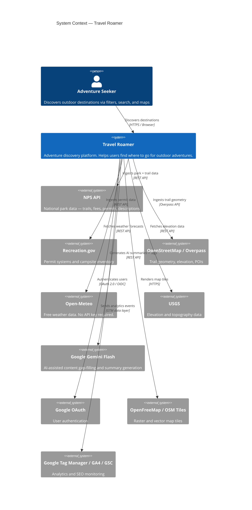
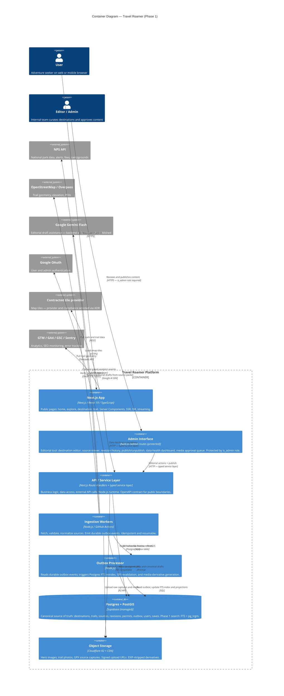
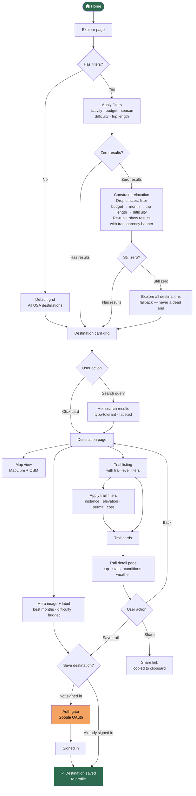
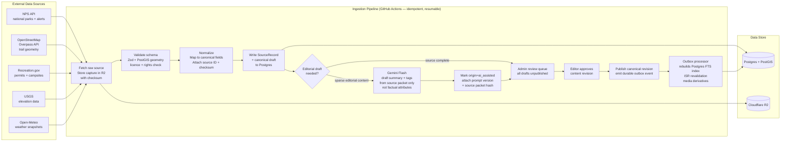
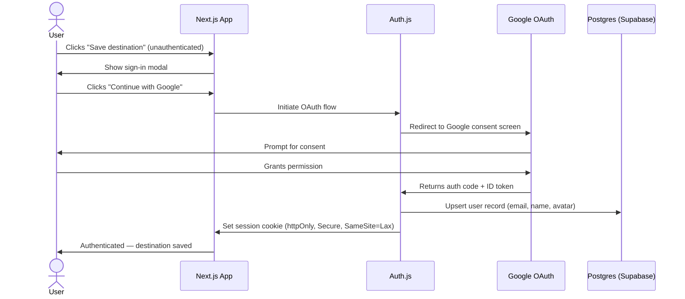
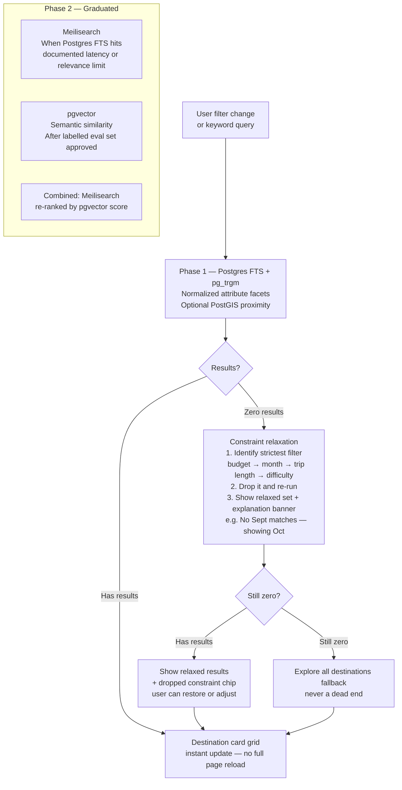

# Architecture — Travel Roamer

**Version:** 1.1 (aligned with PRD v1.1)  
**Status:** Draft  
**Last updated:** 2026-07-23

> **Phase 1 vs Phase 2:** Postgres + PostGIS is the canonical Phase 1 store. Search in Phase 1 uses Postgres FTS + `pg_trgm`. Meilisearch, pgvector, and Redis are deferred until their documented graduation criteria are met. Every diagram marks deferred components explicitly.

---

## Contents

1. [System Context (C4 Level 1)](#1-system-context)
2. [Container Diagram (C4 Level 2)](#2-container-diagram)
3. [Entity Relationship Diagram](#3-entity-relationship-diagram)
4. [User Flow](#4-user-flow)
5. [Data Ingestion Pipeline](#5-data-ingestion-pipeline)
6. [Authentication Flow](#6-authentication-flow)
7. [Search Architecture](#7-search-architecture)
8. [Service Boundaries](#8-service-boundaries)
9. [Key Technical Decisions](#9-key-technical-decisions)

---

## 1. System Context

Who and what the platform interacts with at the highest level.



---

## 2. Container Diagram

Phase 1 launch services are in the main boundary. Meilisearch, pgvector, and Redis are **Phase 2 deferred** — added only when their documented graduation criteria are met.



> **Phase 2 deferred** (adopted only when graduation criteria in the PRD are met):
> - **Meilisearch** — replaces Postgres FTS when documented relevance or p95 latency targets cannot be met
> - **pgvector** — semantic similarity after labelled evaluation set and relevance budget approved
> - **Redis (Upstash)** — response caching after measured cache-load evidence

---

## 3. Entity Relationship Diagram

Updated to reflect the PRD v1.1 data model. `SOURCE_RECORD` and `FACT_ASSERTION` are the provenance backbone — every published fact traces back to a source record. Dynamic data (forecasts, permit status) are expiring snapshots, never permanent fields.

```mermaid
erDiagram

    DESTINATION {
        uuid        id              PK
        string      name
        string      slug            "URL-safe unique identifier"
        geography   location        "PostGIS Point SRID 4326"
        geometry    area            "PostGIS MultiPolygon — nullable"
        string[]    activities      "hiking | backpacking"
        string[]    bestMonths
        string      difficulty      "easy | moderate | hard | expert"
        string      budget          "BudgetEstimate — currency + range + inclusions"
        string      tripLength      "day | 2-3d | 4-7d | 7+d"
        string      label           "Editor Pick | Hidden Gem | Beginner Friendly | Epic"
        float       score           "null until Phase 2 computed score"
        string[]    tags
        string      status          "draft | in_review | published | archived"
        datetime    lastVerifiedAt
        datetime    publishedAt     "null = draft"
        datetime    createdAt
        datetime    updatedAt
    }

    TRAIL {
        uuid        id              PK
        string      name
        string      slug
        geography   routeGeometry   "PostGIS MultiLineString SRID 4326"
        float       distanceMiles
        float       elevationGainFt
        string      difficulty
        float       durationHours
        float       costUSD         "nullable"
        string[]    tags
        string      status          "draft | in_review | published | archived"
        datetime    lastVerifiedAt
        datetime    publishedAt
        datetime    createdAt
        datetime    updatedAt
    }

    DESTINATION_TRAIL {
        uuid        destinationId   FK
        uuid        trailId         FK
        boolean     isRepresentative
        int         editorialOrder
    }

    SOURCE_RECORD {
        uuid        id              PK
        uuid        sourceId        FK
        string      externalId
        string      canonicalUrl    "nullable"
        datetime    retrievedAt
        string      rawObjectKey    "immutable raw capture in R2"
        string      checksum
        string      normalizerVersion
        string      licenceSnapshot
        string      attributionSnapshot
        datetime    validFrom       "nullable"
        datetime    validTo         "nullable"
    }

    CONTENT_REVISION {
        uuid        id              PK
        string      entityType      "destination | trail"
        uuid        entityId
        json        body
        string      origin          "editorial | ai_assisted | community"
        string      promptVersion   "nullable — set for AI-assisted"
        string      reviewStatus    "draft | in_review | approved | rejected"
        uuid        authorId        FK "nullable"
        uuid        reviewedBy      FK "nullable"
        datetime    createdAt
        datetime    publishedAt     "nullable"
    }

    FACT_ASSERTION {
        uuid        id              PK
        string      subjectType     "destination | trail | permit"
        uuid        subjectId
        string      field
        json        value
        uuid        sourceRecordId  FK "nullable"
        string      confidence      "confirmed | editorial | uncertain"
        uuid        reviewedBy      FK "nullable"
        datetime    verifiedAt
        datetime    expiresAt       "nullable"
    }

    PERMIT_REQUIREMENT {
        uuid        id              PK
        string      subjectType
        uuid        subjectId
        string      requirementType "none | reservation | quota | timed-entry | unknown"
        string      scope
        string      officialUrl
        uuid        sourceRecordId  FK
        datetime    lastVerifiedAt
        datetime    expiresAt       "nullable"
    }

    MEDIA_ASSET {
        uuid        id              PK
        string      objectKey       "Cloudflare R2 key"
        string      originalUrl     "nullable"
        uuid        sourceRecordId  FK "nullable"
        uuid        uploadedBy      FK "nullable — Phase 2"
        string      licence
        string      rightsStatus    "verified | restricted | unknown | rejected"
        string      moderationStatus "pending | approved | rejected"
        datetime    exifStrippedAt  "nullable"
        datetime    createdAt
    }

    FORECAST_SNAPSHOT {
        uuid        id              PK
        geography   location        "PostGIS Point"
        string      provider        "open-meteo"
        datetime    validFrom
        datetime    validTo
        datetime    expiresAt       "never serve beyond expiry"
        json        payload
    }

    USER {
        uuid        id              PK
        string      email           "unique"
        string      name
        string      avatarUrl       "nullable"
        string      provider        "google"
        boolean     isAdmin         "false by default"
        string      locale          "en | es"
        datetime    createdAt
        datetime    lastActiveAt
    }

    SAVED_DESTINATION {
        uuid        id              PK
        uuid        userId          FK
        uuid        destinationId   FK
        datetime    savedAt
    }

    REVIEW {
        uuid        id              PK
        uuid        userId          FK
        uuid        destinationId   FK
        int         rating          "1-5"
        text        body
        string      status          "pending | approved | rejected — Phase 2 only"
        datetime    createdAt
    }

    SUBSCRIPTION {
        uuid        id              PK
        uuid        userId          FK
        string      tier            "free | pro"
        string      status          "active | cancelled | expired"
        datetime    startsAt
        datetime    endsAt          "nullable"
        datetime    createdAt
    }

    DESTINATION        ||--o{    DESTINATION_TRAIL    : "listed in"
    TRAIL              ||--o{    DESTINATION_TRAIL    : "appears in"
    DESTINATION        ||--o{    MEDIA_ASSET          : "hero + photos"
    TRAIL              ||--o{    MEDIA_ASSET          : "photos + GPX source"
    DESTINATION        ||--o{    PERMIT_REQUIREMENT   : "has"
    TRAIL              ||--o{    PERMIT_REQUIREMENT   : "has"
    DESTINATION        ||--o{    FACT_ASSERTION       : "verified by"
    TRAIL              ||--o{    FACT_ASSERTION       : "verified by"
    DESTINATION        ||--o{    SAVED_DESTINATION    : "saved by"
    DESTINATION        ||--o{    REVIEW              : "reviewed by (Phase 2)"
    SOURCE_RECORD      ||--o{    FACT_ASSERTION       : "supports"
    SOURCE_RECORD      ||--o{    PERMIT_REQUIREMENT   : "verifies"
    SOURCE_RECORD      ||--o{    MEDIA_ASSET         : "sourced from"
    USER               ||--o{    SAVED_DESTINATION    : "saves"
    USER               ||--o{    REVIEW              : "writes (Phase 2)"
    USER               ||--o|    SUBSCRIPTION        : "has"
```



---

## 4. User Flow

The complete end-to-end flow a user takes from landing to saving a destination.



---

## 5. Data Ingestion Pipeline

A controlled publishing pipeline, not a seed script. Every run is idempotent, auditable, and resumable. Content cannot be published without passing through the editorial review queue.



> **AI rule:** Gemini Flash may draft a summary or propose tags from a supplied source packet. It may not fill factual attributes (difficulty, permits, duration, budget, conditions). AI-drafted content enters the review queue with `origin=ai_assisted` and cannot be auto-published.

---

## 6. Authentication Flow

Sign-in via Google OAuth using Auth.js (Next.js App Router adapter).



---

## 7. Search Architecture

**Phase 1:** Postgres FTS + `pg_trgm` — one source of truth, no external index service. Supports keyword, typo-tolerance, and faceted filters sufficient for a 25–50 destination corpus.

**Phase 2:** Meilisearch adopted when Postgres FTS hits a documented relevance or p95 latency limit. pgvector added after a labelled evaluation set is approved.



**Phase 1 index (Postgres FTS `tsvector` + facet columns):**

```
columns: name, summary, tags, park, region (for FTS)
facet columns: activities[], difficulty, budget, tripLength, bestMonths[], permitRequired, state, region
spatial: location Geography(Point) for proximity queries
sortable: score, publishedAt
```

**Phase 2 Meilisearch document (when graduated):**

```
{
  id, name, slug, state, region, park,
  activities[], bestMonths[], difficulty, budget,
  tripLength, label, tags[], summary,
  permitRequired, lat, lng
}
```

**Zero-result relaxation rule:** never render a hard "No results" terminal state. Every zero-result response relaxes one constraint with visible transparency. Maximum two relaxations before the all-destinations fallback.

---

## 8. Service Boundaries

Four bounded domains within the monorepo. Explicit import rules prevent coupling and make Phase 3 extraction straightforward.

```
/src
  /content          ← Content Domain (read-only published data)
    destinations/
    trails/
    media/
    search/

  /platform         ← Platform Domain (all write paths for data operations)
    sources/          source registry + SourceRecord
    ingestion/        ingestion workers + validation
    outbox/           outbox processor + event types
    content-revisions/ ContentRevision + FactAssertion
    permits/          PermitRequirement
    forecasts/        ForecastSnapshot

  /admin            ← Admin Domain (editorial interface)
    dashboard/        data-health dashboard
    destinations/     destination editor + publish actions
    sources/          source record viewer
    revisions/        revision history + approval queue
    media/            media approval queue

  /user             ← User Domain
    auth/
    saved/
    reviews/          Phase 2 — disabled at launch
    subscriptions/    Phase 2 — disabled at launch
    profiles/

  /shared           ← Shared
    types/
    utils/
    config/
```

**Import rules:**
- `/content` reads published records only. Never imports from `/user`, `/platform`, or `/admin`.
- `/platform` owns all write paths. Never imports from `/user`.
- `/admin` may import from `/content` and `/platform`. All routes protected by `is_admin` middleware.
- `/user` may reference content IDs but never mutates editorial records.

---

## 9. Key Technical Decisions

Short rationale for major choices. Full ADRs live in `/docs/adr/`. Decisions marked **(Phase 2)** are deferred until graduation criteria are met.

| Decision | Choice | Rationale |
|---|---|---|
| Framework | Next.js (current supported stable major — pin version in ADR) | Server Components + SSR + ISR in one framework. Vercel-native. Best SEO story. |
| API layer | Next.js Route Handlers + typed service layer | One API framework for Phase 1. No tRPC. OpenAPI contract for public/internal boundaries. Node.js runtime by default; Edge only where all dependencies are compatible. |
| Database | Supabase (Postgres + PostGIS) | Managed Postgres with PostGIS for spatial queries (trail geometry, proximity, region bounds). Single canonical source of truth. |
| Spatial | PostGIS | Required for Geography/Geometry storage, proximity filters, trail route display, and region bounds. Separate display coordinates are projections of canonical geography data. |
| ORM | Prisma | Type-safe, migrations, Next.js compatible. PostGIS queries via raw SQL where needed. |
| Phase 1 search | Postgres FTS + `pg_trgm` | One source of truth for the Phase 1 corpus (25–50 destinations). No separate index service until Postgres hits a documented limit. |
| Phase 2 search | Meilisearch *(Phase 2)* | Adopted when a benchmarked beta shows Postgres cannot meet a documented relevance or p95 latency target. Outbox-driven indexer with reconciliation job required. |
| Semantic search | pgvector *(Phase 2)* | After labelled evaluation set, relevance budget, and explicit filter-handling requirements are approved. |
| Cache | Upstash Redis *(Phase 2)* | Serverless, edge-compatible. Adopted after measured cache-load evidence; invalidation ownership documented before introduction. |
| Auth | Auth.js v5 | Official Next.js App Router adapter. One explicit session strategy (database sessions or JWT — pick in ADR). Google OAuth. |
| Storage | Cloudflare R2 | S3-compatible, no egress fees, global CDN. Signed upload URLs. EXIF stripping on all user-uploaded media. |
| AI | Google Gemini Flash (editorial use only) | Free tier. `@google/generative-ai` SDK. Editorial draft assistance from source packets — backend only, never auto-published, never used to invent factual attributes. |
| Maps | MapLibre GL + contracted tile provider | MapLibre is the renderer. Tile provider selected via ADR for compliance, volume limits, and fallback. OSM attribution required. |
| Admin tooling | Next.js `/admin` routes (protected) | Custom code, no external CMS. Protected by `is_admin` role. Destination editor, source viewer, revision history, publish/unpublish, data-health dashboard, media queue. |
| i18n | next-intl | App Router native. Locale-prefixed routes. EN Phase 1; ES gated on localized-content release criteria. |
| Styling | Tailwind CSS 4 + shadcn/ui | Utility-first, consistent component library. |
| Testing | Vitest + Playwright + axe-core | Vitest for unit/component + rubric/provenance rules. Playwright for E2E including zero-result relaxation, mobile viewports, and auth flows. axe-core in CI for accessibility. |
| Hosting | Vercel (paid plan) | Zero-config Next.js. ISR. Preview deployments per PR. Commercial use requires paid plan. |
| CI/CD | GitHub Actions | Tests, Lighthouse CI, deploy to Vercel. Scheduled ingestion jobs. Idempotent batch only — not for urgent alert refreshes. |
